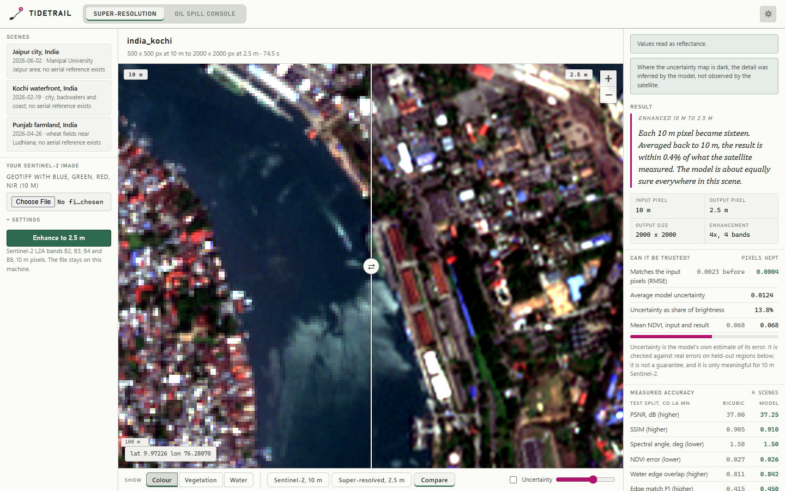
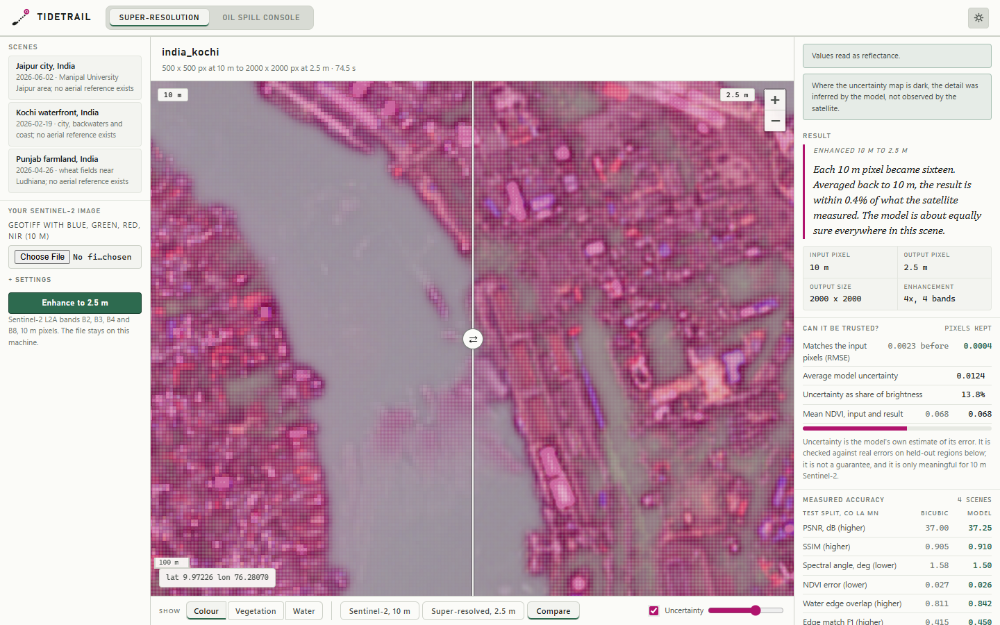
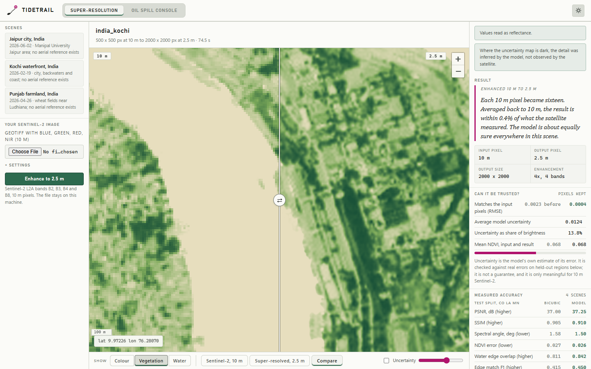
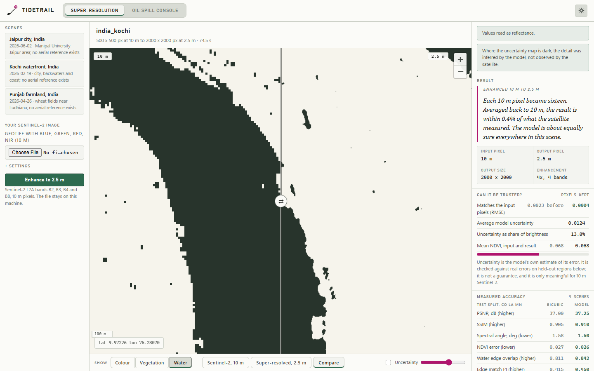
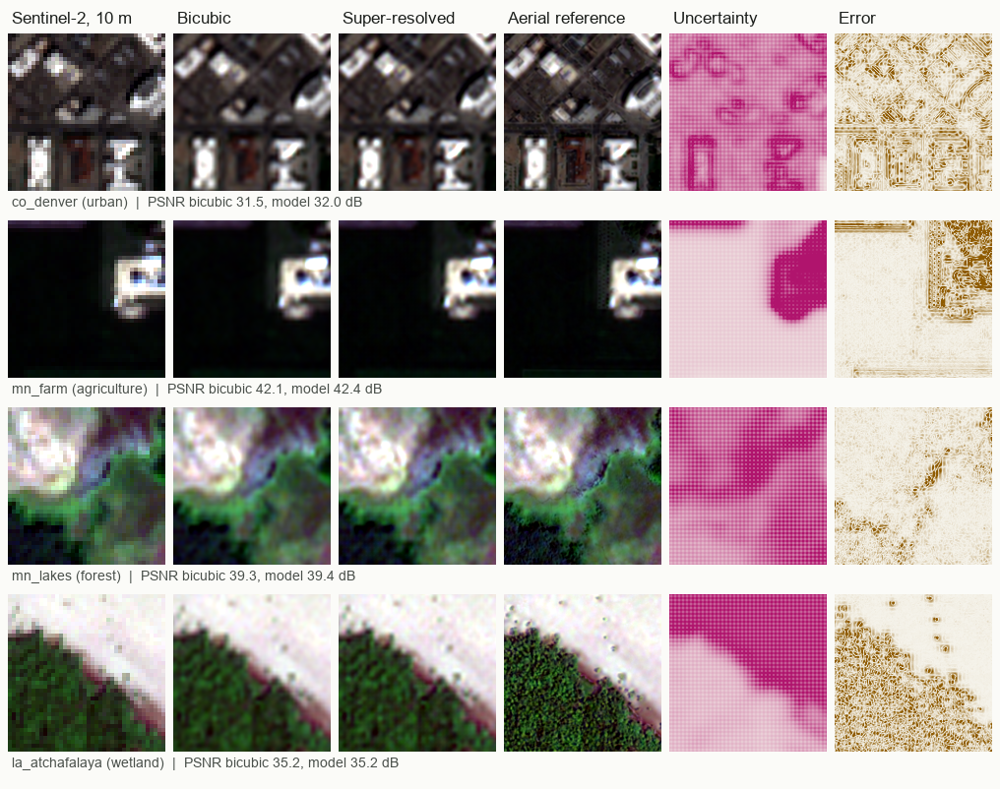
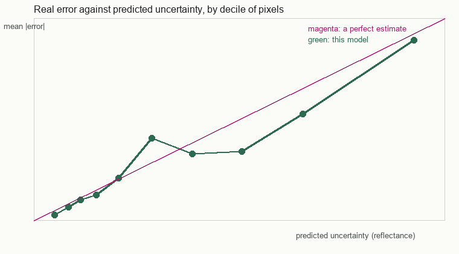
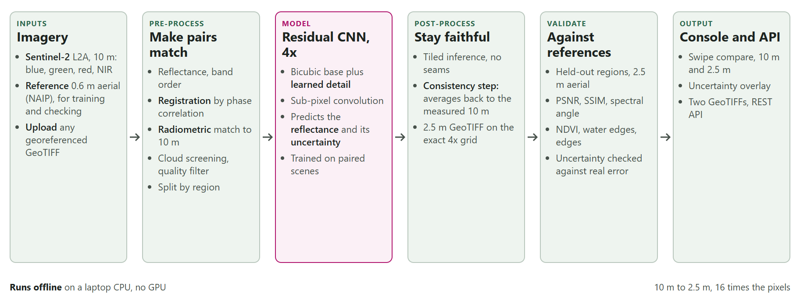

# TideTrail

**Deep learning super-resolution mapping of Sentinel-2 imagery**

Smart India Hackathon 2026 · **Problem Statement ID 26142** · National Technical Research Organisation (NTRO) · Software · Theme: Space Technology

> **Deep Learning Based Super Resolution Mapping (SRM) from Medium Resolution Satellite Imageries**

TideTrail turns free 10 m Sentinel-2 imagery (blue, green, red, near infrared) into a 2.5 m image,
four times sharper in each direction. A residual CNN adds learned detail to a bicubic enlargement, a
consistency step moves every 10 m pixel back to the value the satellite measured, and a second output
says, per pixel, how far the added detail should be trusted. It is trained on paired Sentinel-2 and 0.6 m
aerial scenes and scored on regions the model never saw in training.

It runs on one laptop CPU, offline, with no GPU. A console with a 10 m versus 2.5 m swipe, vegetation
and water layers and an uncertainty overlay is served at `/`.

```
4 held-out scenes  ·  PSNR 37.25 dB against 37.00 dB bicubic  ·  better on 4 of 4  ·  consistency with the input 0.0001
```

---

## Contents

- [Screenshots](#screenshots)
- [Measured results](#measured-results)
- [Architecture](#architecture)
- [How each stage works](#how-each-stage-works)
- [Replicate it](#replicate-it)
- [API](#api)
- [Repository layout](#repository-layout)
- [How it answers the problem statement](#how-it-answers-the-problem-statement)
- [Limitations](#limitations)
- [Data and references](#data-and-references)

---

## Screenshots

**Compare.** Left of the handle is the Sentinel-2 image at 10 m, right of it the 2.5 m result, on the same
ground (Kochi waterfront, India). The right rail shows how well the result matches the input pixels, the
model's average uncertainty, and the measured accuracy on held-out scenes.



**Uncertainty.** The magenta overlay marks where the detail is inferred rather than observed. Darker means
less sure.



**Vegetation (crop monitoring).** NDVI of the input and of the result, for field-scale crop monitoring.



**Water (flood and shoreline mapping).** Open water from the green and NIR bands, input against result.



**Held-out test scenes.** For four test scenes: the Sentinel-2 input, bicubic, the super-resolved result, the
aerial reference, the predicted uncertainty and the real error.



**Is the uncertainty honest?** Real mean error against predicted uncertainty by decile of pixels. A perfect
estimate lies on the magenta line.



---

## Measured results

Scored on **4 test scenes** in **CO, LA, MN**, states with no scene in training, against NAIP 0.6 m
aerial imagery resampled to 2.5 m. The model is an early checkpoint (250 training iterations).

| Metric | Bicubic | TideTrail | Better when |
| --- | --- | --- | --- |
| PSNR, dB | 37.00 | 37.25 | higher |
| SSIM | 0.905 | 0.910 | higher |
| RMSE, reflectance | 0.0157 | 0.0152 | lower |
| Spectral angle, degrees | 1.58 | 1.50 | lower |
| NDVI error | 0.027 | 0.026 | lower |
| Open-water overlap (IoU) | 0.811 | 0.842 | higher |
| Edge match F1 | 0.415 | 0.450 | higher |
| Consistency with the input pixels | 0.0027 | 0.0001 | lower |

PSNR gain +0.25 dB, 95% bootstrap interval +0.09 to +0.40 over scenes, better than bicubic on 4 of 4
scenes by PSNR and 4 by SSIM.

Uncertainty: rank correlation with the real error 0.24 (pooled over pixels 0.51); the stated 90%
intervals cover 91% of pixels; the real error is 7.0 times larger where the model is least sure than
where it is surest.

**What "reference" means here.** The aerial image, averaged back to 10 m, differs from Sentinel-2 by about 0.05
reflectance (the two were taken weeks apart, at different sun angles, by different sensors). Training and
scoring therefore use the aerial image *anchored* to the Sentinel-2 pixels: its smooth 10 m difference from the
input is removed and its detail kept, so what is scored is the detail inside each pixel. Against the
unanchored aerial image the model is level with bicubic (28.85 dB against 28.88 dB).

Re-run it with `python scripts/evaluate_sr.py` (add `--tta` for flip averaging). Results are written to
`data/validation/sr_metrics.json`.

---

## Architecture



The diagram source is [docs/sr_architecture.html](docs/sr_architecture.html).

| Stage | What happens | Code |
| --- | --- | --- |
| Inputs | Sentinel-2 L2A bands B2, B3, B4, B8 at 10 m, from an uploaded GeoTIFF. For training and checking, NAIP 0.6 m aerial imagery. | `app/sr/infer.py`, `scripts/fetch_sr_pairs.py` |
| Pre-process | Reflectance scaling and band order, cloud screening, sub-pixel registration, radiometric matching, split by region. | `scripts/fetch_sr_pairs.py` |
| Model | Residual CNN, bicubic base plus learned detail, sub-pixel convolution, mean and uncertainty heads. | `app/sr/model.py` |
| Post-process | Tiled inference with seam-free stitching, then the consistency step. Output on the exact 4x grid. | `app/sr/infer.py`, `app/sr/metrics.py` |
| Validate | Held-out regions against 2.5 m aerial reference: PSNR, SSIM, spectral angle, NDVI, water, edges, uncertainty calibration. | `scripts/evaluate_sr.py`, `app/sr/metrics.py` |
| Output | Console, REST API, two GeoTIFFs (result and uncertainty). | `app/api/sr.py`, `app/static/sr.*` |

---

## How each stage works

### Data and pre-processing

`scripts/fetch_sr_pairs.py` builds the paired dataset from two free sources on Microsoft Planetary Computer,
with no account: Sentinel-2 L2A and NAIP. It reads Cloud Optimized GeoTIFF windows, so nothing large is downloaded.

- **Pairing.** A Sentinel-2 scene within 35 days of the NAIP flight and under 10% cloud over the window. NAIP is
  reprojected onto a 2.5 m grid that sits exactly on the Sentinel-2 grid, four reference pixels to one input pixel.
- **Cloud screening.** Scene Classification Layer classes 0, 1, 3, 8, 9, 10 and 11 are treated as unusable.
- **Registration.** The two products are geolocated independently. The shift is measured by phase correlation with
  a parabolic sub-pixel peak and removed. Pairs shifting more than 2 pixels are dropped.
- **Radiometry.** A per-band linear map makes the aerial numbers agree with Sentinel-2 reflectance. Pairs with a
  correlation under 0.70 are dropped.
- **Splits by region.** Train, validation and test sites are in different states, so test scores measure
  generalisation to new land cover and climate.
- **Anchoring.** See "What reference means here" above; implemented in `app/sr/data.py`.

### The network

`app/sr/model.py`: a residual CNN of 0.69 M parameters. A global bicubic skip means an untrained network is
exactly a bicubic enlargement, so training only adds detail. Twelve residual blocks, then sub-pixel convolution
(pixel shuffle) for the 4x step, then two heads: the reflectance, and the log scale of a Laplace distribution,
which is the per-pixel uncertainty.

### Training

`app/sr/train.py`. Loss is L1 on reflectance, plus 0.5 times L1 on image gradients (to keep edges), plus 0.1 times
a Laplace negative log-likelihood for the uncertainty head, with the predicted mean detached so the likelihood
can only shape the uncertainty, never bend the image. Random flips and quarter turns, AdamW with a cosine
schedule, CPU only. The run is resumable (state saved every 200 iterations) and keeps the best validation
checkpoint in `models/sr_x4.pt`.

### Inference and the consistency step

`app/sr/infer.py` runs overlapping tiles with cosine-weighted stitching, with optional eight-way flip averaging.
`app/sr/metrics.py:project_consistent` then adds back the smooth difference between the input and the
result averaged to 10 m, a few times, so that every 4 x 4 block of output averages to the pixel the satellite
measured. The detail inside each block is kept. The result is written as a GeoTIFF with the input's CRS and
top-left corner and a quarter of the pixel size.

### Uncertainty

The second output is saved as its own GeoTIFF and drawn as an overlay. It is the model's own estimate, checked
against real errors on held-out scenes (see the results above). It is not a guarantee, and it is only meaningful
for 10 m Sentinel-2 input.

---

## Replicate it

Python 3.11 or newer. A CPU is enough.

```bash
git clone https://github.com/S-T-A-RNalin1/TideTrail.git
cd TideTrail
python -m venv .venv
```

```bash
.venv\Scripts\activate          # Windows
source .venv/bin/activate       # Linux and macOS
```

```bash
python -m pip install -r requirements.txt
```

**Run the console.** The trained checkpoint (`models/sr_x4.pt`), three bundled Indian demo scenes and the
measured results are committed, so this works straight after install:

```bash
python -m uvicorn app.main:app --host 127.0.0.1 --port 8000
```

Open <http://127.0.0.1:8000>, pick a scene on the left (or upload a Sentinel-2 GeoTIFF with blue, green, red
and NIR bands) and press **Enhance to 2.5 m**. A 3.2 km scene takes well under a minute on a laptop CPU.

**Rebuild the data, retrain and re-score.** The paired scenes are about 240 MB for 34 scenes and are not
committed, so rebuild them once while online:

```bash
python scripts/fetch_sr_pairs.py --split train --workers 4
python scripts/fetch_sr_pairs.py --split val
python scripts/fetch_sr_pairs.py --split test
```

Then train (resumable; add `--fresh` to start over) and score on the held-out regions:

```bash
python -m app.sr.train --iters 5000 --budget-min 150 --eval-every 250
python scripts/evaluate_sr.py
```

**Add your own demo scene** (any place, from Sentinel-2 L2A):

```bash
python scripts/fetch_sr_demo.py --name jaipur --title "Jaipur city" --lat 26.9124 --lon 75.7873 --km 5 --from 2025-01-01 --to 2025-12-31
```

Settings: `TIDETRAIL_DATA` and `TIDETRAIL_MODELS` move the data folder and the checkpoint folder.

---

## API

| Method | Path | Purpose |
| --- | --- | --- |
| GET | `/api/health` | version, whether the checkpoint and validation file are present |
| POST | `/api/sr/enhance` | upload a Sentinel-2 GeoTIFF (`band_order`, `dn_offset`, `tta`, `project`); returns the result document |
| GET | `/api/sr/demos` | the bundled scenes |
| POST | `/api/sr/demo/{name}` | enhance a bundled scene |
| GET | `/api/sr/jobs/{id}/progress` | tile progress of a run in flight |
| GET | `/api/sr/jobs/{id}/download/sr.tif` | the 2.5 m GeoTIFF (uint16, reflectance x 10000) |
| GET | `/api/sr/jobs/{id}/download/uncertainty.tif` | the per-pixel uncertainty GeoTIFF |
| GET | `/api/sr/validation` | the measured results |
| GET | `/` | the console |

A file that cannot be used is refused with a sentence that says why (wrong pixel size, wrong band count, too
large for memory), and nothing is left half written.

---

## Repository layout

```
app/
  main.py            FastAPI app and the console page
  config.py          paths and identity
  api/sr.py          the API above
  sr/
    model.py         residual CNN, checkpoint IO
    data.py          paired scenes, the anchored reference, training crops
    train.py         resumable training
    infer.py         GeoTIFF reading and writing, tiled inference, previews
    metrics.py       PSNR, SSIM, spectral angle, NDVI, water, edges, uncertainty, consistency
  static/            sr.html, sr.js, sr.css, style.css, vendored Leaflet
scripts/
  fetch_sr_pairs.py  build the Sentinel-2 and NAIP training pairs
  fetch_sr_demo.py   cut a Sentinel-2 demo scene for the console
  evaluate_sr.py     score the model on held-out regions, write figures
models/sr_x4.pt      the trained checkpoint
data/sr/demo/        three bundled Indian scenes (no reference exists for them)
data/validation/     sr_metrics.json, the measured results
docs/                SRM_COMPLIANCE.md, the architecture diagram, screenshots
TideTrail_SIH26142_Final.pptx and .pdf    the Smart India Hackathon presentation
```

The earlier SAR oil-spill version of this project is kept in the git tag `oil-spill-final`.

---

## How it answers the problem statement

| Requirement of Problem Statement 26142 | Status |
| --- | --- |
| 10 m Sentinel-2 in, finer than 4 m out | Met: 4x, 2.5 m, on an exact grid |
| Deep learning framework | Met with a CNN. No transformer or generative model was built |
| Geospatial and spectral consistency | Met: same CRS and corner, averages back to the measured pixel, spectral angle reported |
| Pre-processing | Met: reflectance, cloud screening, registration, radiometric matching |
| Training on paired datasets | Met: Sentinel-2 and 0.6 m aerial pairs |
| Accuracy assessment and validation against high-resolution references | Met for US regions only, on 4 held-out scenes |
| Crop monitoring, urban analysis, disaster assessment | Partly: NDVI, edge and water outputs are measured; no downstream classification or change-detection experiment |
| Uncertainty and error accounting | Met: per-pixel uncertainty, checked against real error |

The clause-by-clause table, with how to verify each, is [docs/SRM_COMPLIANCE.md](docs/SRM_COMPLIANCE.md).

---

## Limitations

- **A CNN only.** No transformer or generative model was built. A generative model would add convincing texture,
  which is the failure the consistency step and the uncertainty map exist to catch.
- **An early checkpoint and a small test set.** 250 training iterations, 27 training pairs and 4 test scenes.
  The gain over bicubic is modest and the sample is small.
- **US land only.** Free 0.6 m aerial references do not cover India, so the three bundled Indian scenes show
  the enhancement and the model's uncertainty but carry no accuracy score.
- **Sentinel-2 comes from the Planetary Computer mirror** of the ESA L2A archive when building pairs. It is the
  same product the Copernicus Data Space Browser serves; export from the Browser and upload the GeoTIFF to use it directly.
- **Scenes are small** (3.2 km square) to fit a laptop.
- **No downstream task** was trained on the output. The NDVI, water and edge scores say the output is closer to the
  reference than bicubic is, not that a crop or flood map built on it is better.

---

## Data and references

- Sentinel-2 L2A, ESA Copernicus, via [Copernicus Data Space](https://browser.dataspace.copernicus.eu) and
  [Microsoft Planetary Computer](https://planetarycomputer.microsoft.com/dataset/sentinel-2-l2a)
- NAIP aerial imagery, USDA, via [Planetary Computer](https://planetarycomputer.microsoft.com/dataset/naip)
- Dong et al. (2016), SRCNN, IEEE TPAMI, [arXiv:1501.00092](https://arxiv.org/abs/1501.00092)
- Lim et al. (2017), EDSR, CVPR Workshops, [arXiv:1707.02921](https://arxiv.org/abs/1707.02921)
- Wang et al. (2018), ESRGAN, ECCV Workshops, [arXiv:1809.00219](https://arxiv.org/abs/1809.00219)
- Liang et al. (2021), SwinIR, ICCV Workshops, [arXiv:2108.10257](https://arxiv.org/abs/2108.10257)
- Lanaras et al. (2018), DSen2, ISPRS J. Photogramm. Remote Sens. 146, [arXiv:1803.04271](https://arxiv.org/abs/1803.04271)
- Cornebise et al. (2022), WorldStrat, NeurIPS Datasets and Benchmarks, [arXiv:2207.06418](https://arxiv.org/abs/2207.06418)
- Michel et al. (2022), SEN2VENuS, Data 7(7), 96, [DOI](https://doi.org/10.3390/data7070096)
- Wald, Ranchin and Mangolini (1997), Fusion of satellite images of different spatial resolutions, PE&RS 63(6)
- Kendall and Gal (2017), Uncertainties in Bayesian deep learning, NeurIPS, [arXiv:1703.04977](https://arxiv.org/abs/1703.04977)

## Licence

MIT. See [LICENSE](LICENSE).
